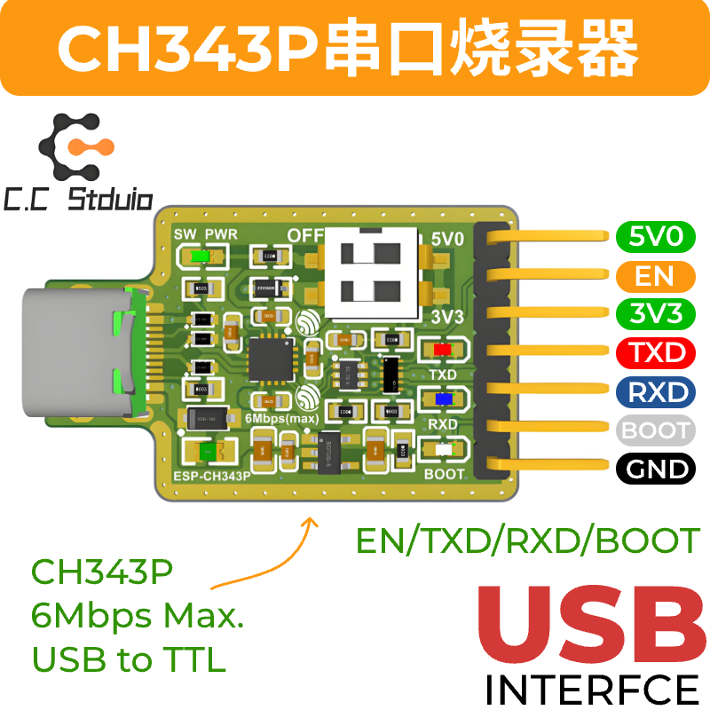
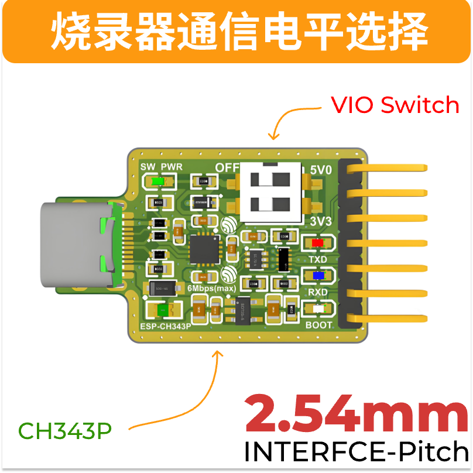

# WeActStudio.USB2SerialV1

USB to serial port module based on CH343P, with RTS and DTR

* Full speed USB device interface, USB 2.0 compatible.
* Support communication baud rate of `50Bps ~ 6Mbps`.
* Optional `3.3V/5V` TTL level input and output, while supporting external setting of target level, level range of `1.8V~5V`.
* Support installation free CDC class built-in operating system drivers or multi-functional high speed VCP vendor drivers.
* CH343P has built-in EEPROM and can be configured with VID, PID, maximum current value, manufacturer and product information string, etc.
* Built-in Unique ID(USB Serial Number).

## I/O Power supply selection

1. When VIO is connected to 5V0 through the dip switch (upper level), the TXD/RXD/EN/BOOT level is 5V, supporting single-chip microcomputer communication devices that adapt to a 5V voltage threshold.
2. When VIO is connected to 3V3 through the dip switch (lower position), the TXD/RXD/EN/BOOT level is 3.3V, supporting single-chip microcomputer communication devices that adapt to the 3V3 voltage threshold.
3. When VIO is connected to the corresponding input power supply, TXD/RXD/EN/BOOT is determined by the input power supply voltage, and the level adaptation range should be between 1.8V and 5V.
4. The 5V0/3V3 does not have an anti-backflow function. When the subsequent connected device (module /demo board) has an additional input power supply, please do not connect it to the 5V0 or 3V3 of the burner. Just connect it to the reference ground.

## Driver install
See the `Drivers` folder