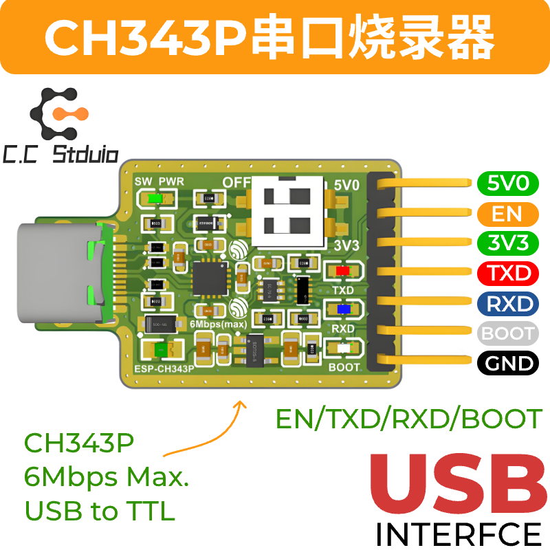
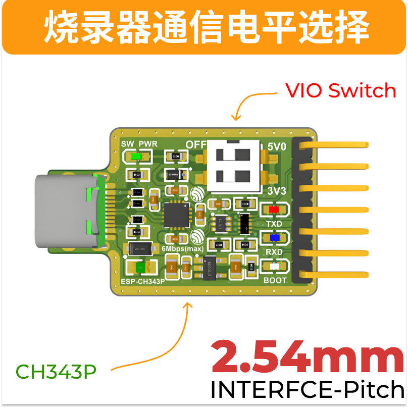

# WeActStudio.USB2SerialV1

基于CH343P的USB转串口模块，带有自动下载控制电路，设计有ESP_EN和ESP_BOOT控制脚使其实现自动下载烧录。

* 全速USB设备接口，兼容 USB 2.0。
* 支持通讯波特率 `50bps～6Mbps`。
* 可选 `3.3V/5V` TTL 电平输入输出，同时支持外部设置目标电平，电平范围`1.8V~5V`。
* 支持免安装的操作系统内置 CDC 类驱动程序或者多功能高速率的 VCP 厂商驱动程序。
* CH343P 内置 EEPROM，可配置芯片 VID、PID、最大电流值、厂商和产品信息字符串等参数。
* 芯片内置 Unique ID(USB Serial Number)。

## 电平选择

1. 当VIO通过拨码开关(上位)接入5V0时，TXD/RXD/EN/BOOT电平为5V，支持适配5V电压阈值的单片机通信设备。
2. 当VIO通过拨码开关(下位)接入3V3时，TXD/RXD/EN/BOOT电平为3.3V，支持适配3V3电压阈值的单片机通信设备。
3. 当VIO接入对应输入电源时，TXD/RXD/EN/BOOT由输入电源电压决定，电平适配范围需在1.8V~5V。
4. 5V0/3V3不具备防倒灌功能，当后级连接设备(模组/demo板)存在额外的输入电源时，请不要将其连接至烧录器的5V0或3V3，只需连接参考地。

## 驱动安装
见`02.Drivers`文件夹
